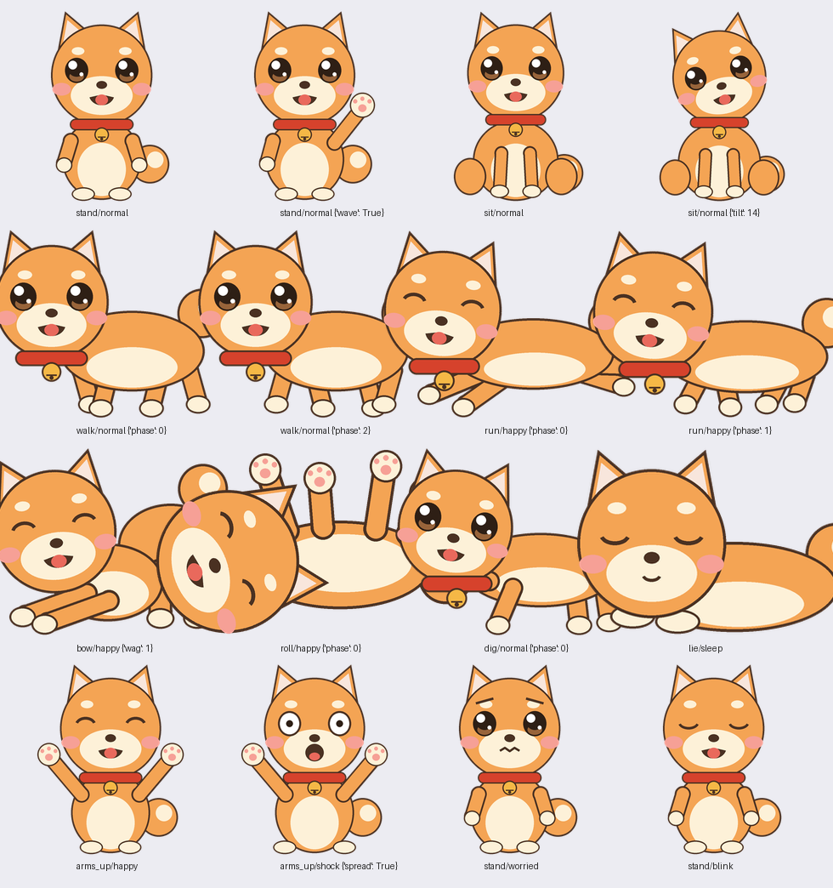

# TeamsPet 🐕 — Teams 알림 데스크탑 시바펫

바탕화면에 상주하는 시바견 펫입니다. 평소엔 네발로 산책하고 낮잠 자고 혼자 놀다가,
**Microsoft Teams로 등록한 사람(교수님, 팀장님 등)의 메시지가 오면
2배 크기로 거대해져서 화면 맨 앞에서 날뜁니다.**
클릭하거나 Teams에서 메시지를 읽으면 진정합니다.



## 다운로드 (일반 사용자)

[Releases](../../releases)에서 최신 zip을 받아 압축을 풀고 `TeamsPet.exe`를
실행하세요. **Python 설치가 필요 없습니다.**

1. exe를 아무 폴더에 두고 더블클릭 (설정 파일이 exe 옆에 생성됨)
2. "Windows의 PC 보호" 경고가 뜨면 "추가 정보 → 실행"
   (서명 없는 개인 제작 프로그램이라 뜨는 표준 경고입니다)
3. 첫 실행 시 설정 창이 자동으로 열림 → 감시할 사람 이름을
   한 줄에 한 명씩 입력 (여러 명 가능, 이름 일부만 적어도 됨)
4. "Windows 시작 시 자동 실행" 체크 추천 → 저장

## 기능

### 펫 행동 (자율 모드)
- 화면 맨 아래 띠를 따라 **네발로 산책** (4프레임 보행)
- 가끔 신나서 **전력질주(zoomies)** 후 플레이바우로 마무리
- 앉아서 쉬기, 눈 깜빡임(4초마다), 졸다가 엎드려 낮잠
- 혼자 놀기: 손 흔들기 / 땅파기 / 고개 갸우뚱
- **클릭**: 하트 / 멍멍! / 한바퀴 / 점프 / 손인사 / 벌러덩 중 랜덤 반응
- **드래그**: 위치 이동 (기억됨)
- 평소엔 모든 창 **뒤**(바탕화면 위)에 있어서 작업을 가리지 않음

### 알림 감지 — 2중 채널

| 채널 | 주기 | 알 수 있는 것 | 펫 반응 |
|---|---|---|---|
| ① Windows 알림 센터 | 2초 | 보낸 사람 + 내용 | 등록된 사람이면 **거대화 + 풀 난동** |
| ② Teams 배지 (알림 DB) | 15초 | 안 읽은 개수 | **순한 알림** (걱정 얼굴로 서성) |

- ①은 Windows 알림(토스트)을 OS 수준에서 읽으므로 학교/회사 계정 무관
- ②는 Windows 알림 데이터베이스에서 Teams 배지 숫자를 직접 읽음 —
  토스트를 놓쳐도, Teams 창이 닫혀 있어도 동작
- **자동 진정**: 난동 중 배지가 올라갔다가 0으로 돌아오면(=읽음) 스스로 진정

### 표정 & 포즈
캐릭터는 이미지 파일이 아니라 코드로 그립니다(`draw_shiba.py`).
포즈(서기/걷기/질주/앉기/엎드리기/만세/벌러덩/땅파기/플레이바우)와
표정(기본/깜빡/잠/신남/패닉/걱정)을 자유 조합. 새 포즈는 함수 하나 추가로 확장.

## 설정

펫 우클릭 → "설정..." 또는 exe 옆 `config.json`:

```json
{
  "keywords": ["홍길동", "gildong"],  ← 감시할 사람 (여러 명, 대소문자 무관)
  "watch_apps": ["teams"],
  "poll_seconds": 2,
  "badge_poll_seconds": 15,
  "sound": true,
  "always_on_top": false
}
```

`keywords`를 비우면 모든 Teams 알림에 반응합니다.

## ⚠️ 꼭 필요한 조건

펫은 Teams가 Windows에 흘리는 흔적(알림·배지)을 읽는 방식이라:

1. **Teams 데스크톱 앱이 실행 중**이어야 함 (PC 켠 후 한 번 열어주기)
2. Teams 상태가 **"방해 금지"가 아니어야** 함
3. Teams 설정(⚙) > 알림에서 채팅 메시지 알림이 켜져 있어야 함
4. 펫이 "알림 접근 차단됨!" 말풍선을 보이면: Windows 설정 > 개인 정보 및
   보안 > 알림 > "앱이 알림에 액세스하도록 허용" 켜기
5. 휴대폰으로만 Teams를 쓰면 PC에 흔적이 없어 감지 불가

문제가 있으면 exe 옆에 생기는 `pet.log`를 확인하세요 — "키워드 불일치"에
찍힌 이름이 감시하려는 사람이면 그 표기 그대로 keywords에 추가하면 됩니다.

## 소스로 실행 / 개발

```
pip install pillow winsdk pywinauto
pythonw pet.py          # 상주 실행
python pet.py --test    # 4초 뒤 가짜 알림으로 난동 테스트
```

- `pet.py` — 펫 본체 (상태머신 + 알림 감시 2채널 + 설정 GUI)
- `draw_shiba.py` — 캐릭터 벡터 드로잉 (포즈×표정 렌더러)
- `make_sprite.py`, `make_poses.py`, `shiba_raw.png` — 초기 이미지 기반
  방식의 흔적 (현재 미사용, 참고용)

**exe 빌드 주의**: Anaconda Python으로 PyInstaller를 돌리면 DLL 누락으로
exe가 소리 없이 죽습니다. venv를 만들고 `PATH`에 anaconda `Library\bin`을
추가한 상태로 빌드하거나(`build.bat` 참고), 표준 python.org Python을 쓰세요.

## 자원 사용

평상시 CPU 0.1% 미만, RAM 약 100MB. 모든 프레임은 시작 시 1회 렌더링.

## 라이선스

MIT
